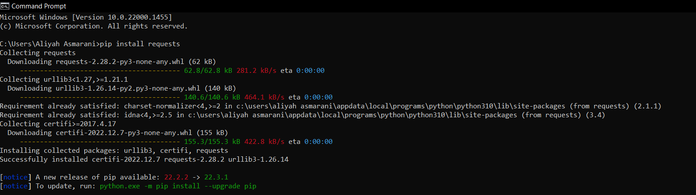
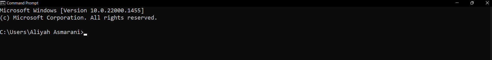
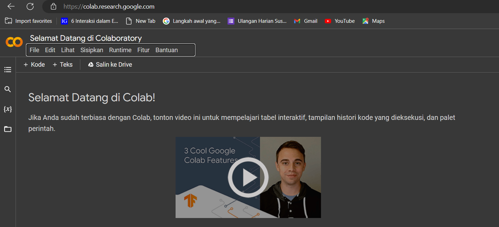
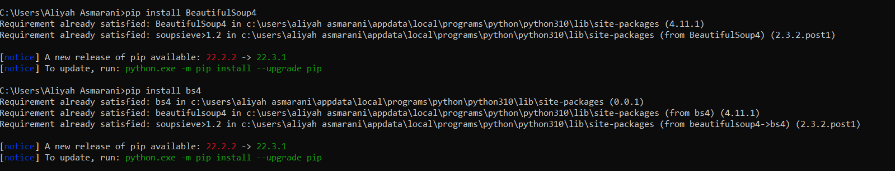
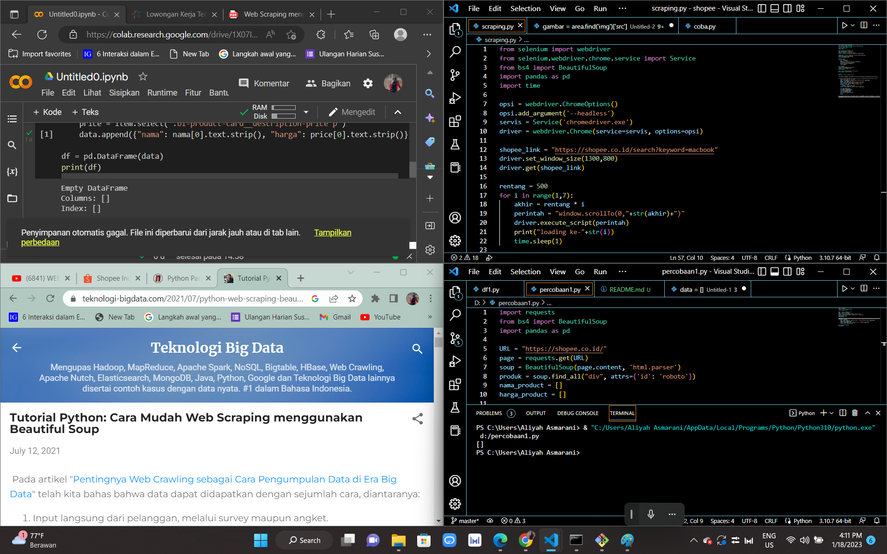

# pertemuan 15 

ASSALAMU'ALLAIKUM WR.WB

```s
NAMA    : ALIYAH ASMARANI
NIM     : 312210203
KELAS   : TI.22.A.2
MATKUL  : BAHASA PEMROGRAMAN
```

# PENGERTIAN PIP 

PIP adalah pengelola package untuk paket python, atau module yang ingin kamu pakai.

# Apa Itu Package?

Package berisi semua file yang kamu butuhkan untuk module.

# Apa Itu Module?

Module adalah kode python yang dapat kamu sertakan dalam project kamu.

# Cara menginstall PIP pada PYTHON

- Langkah 1: Buka Command Prompt
_Catatan : Bahwa kamu telah mendownload PYTHON pada komputer kamu._

- Langkah 2: Ketik `pip install nama_package`

_Contoh Sebagai berikut:_



Jika sudah begitu, maka pip kalian sudah dapat digunakan dala  project yang akan kalian buat.

# WEB SCRAPING

Web Scraping adalah suatu metode otomatis yang digunakan untuk mendapatkan sejumlah besar data dari suatu website. Web Scraping mengacu pada penggunaan software untuk mengekstrak data dari seluruh atau beberapa halaman website.

# Tools Yang Digunakan

- PYTHON : 

`https://www.python.org/`



- GOOGLE COLAB :

`https://colab.research.google.com/`



- REQUESTS :

`pip install requests`


- BEAUTIFULSOUP :

`pip install BeautifulSoup4`
`pip install bs4`



Jika sudah buatlah project baru di Google Colab. dan mulai untuk untuk menscraping web.

`CATATAN : Saya sudah mencoba memahami dan mempelajari bagaimana cara web scraping. tetapi masih belum bisa memahaminya.`

_Ini bukti bahwa saya telah mencoba, tetapi selalu gagal. next time saya akan mencoba memahaminya kembali. jika gagal lagi, saya akan mencoba kembali._



SEKIAN TERIMA KASIH
WASSALAMU'ALAIKUM WR.WB